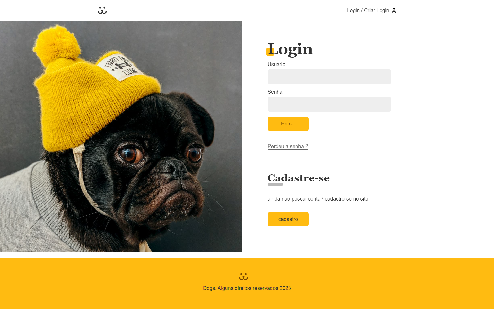
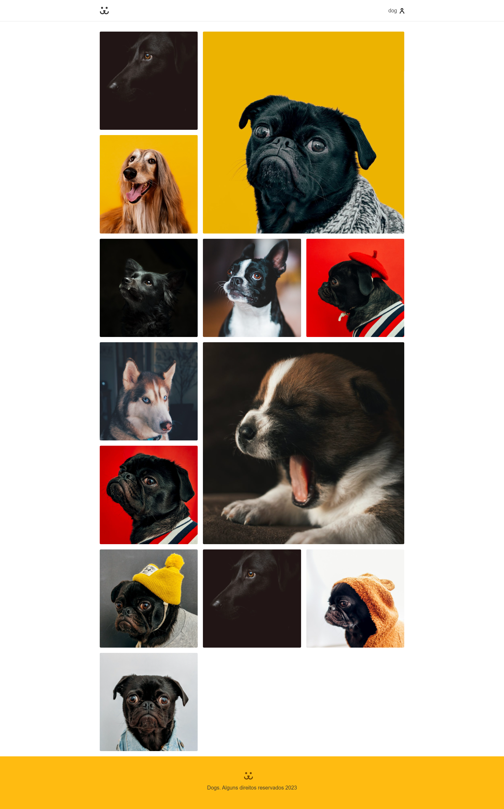
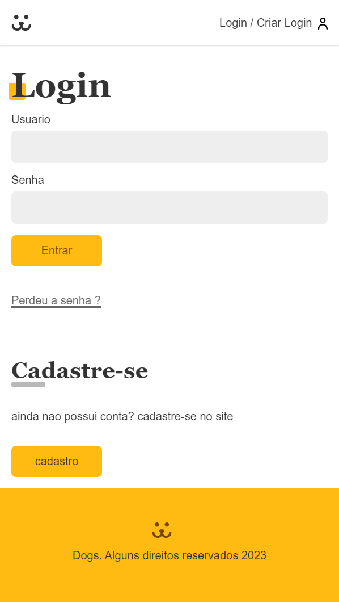

# 🐾 PETSTAGRAM 🐾🐾

<h1 align="center">
  
</h1>

<h1 align="center">
  
</h1>

<h1 align="center">
  
</h1>

<h1 align="center">
  
</h1>

## 🚀 Tecnologias

Esse projeto foi desenvolvido com as seguintes tecnologias:

  - React
  - Vite
  - React Router Dom
  - Styled Components
  - CSS 
  - HTML
  - JS
  - Victory

## 💻 Projeto
  APP para ver fotos de pet e postar a dos seus, criado no curso de react da Origamid. 
  -Victory utilizado para os graficos.
                                                                 
## 🔖 Layout
Você pode visualizar o projeto  através [desse link](https://petstagram-livid.vercel.app/).
